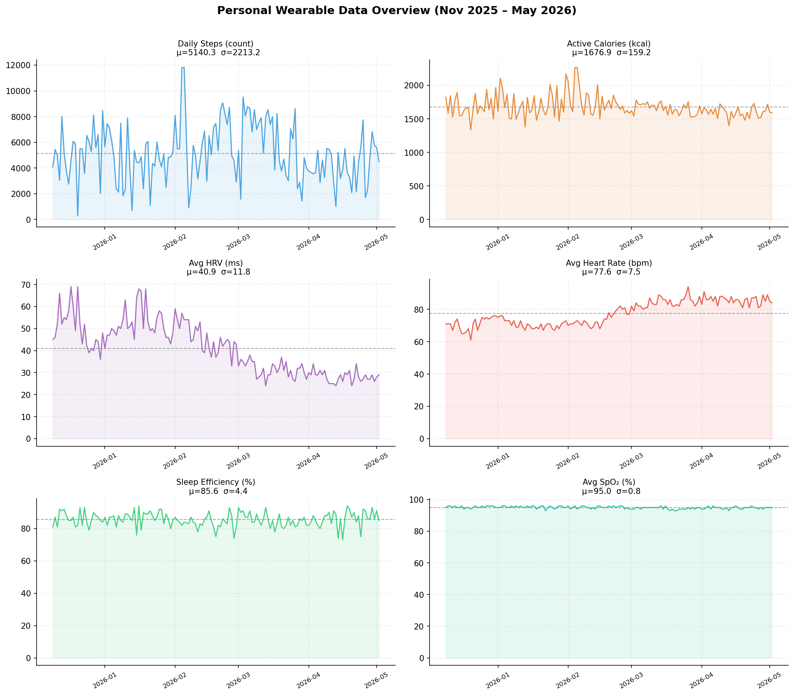
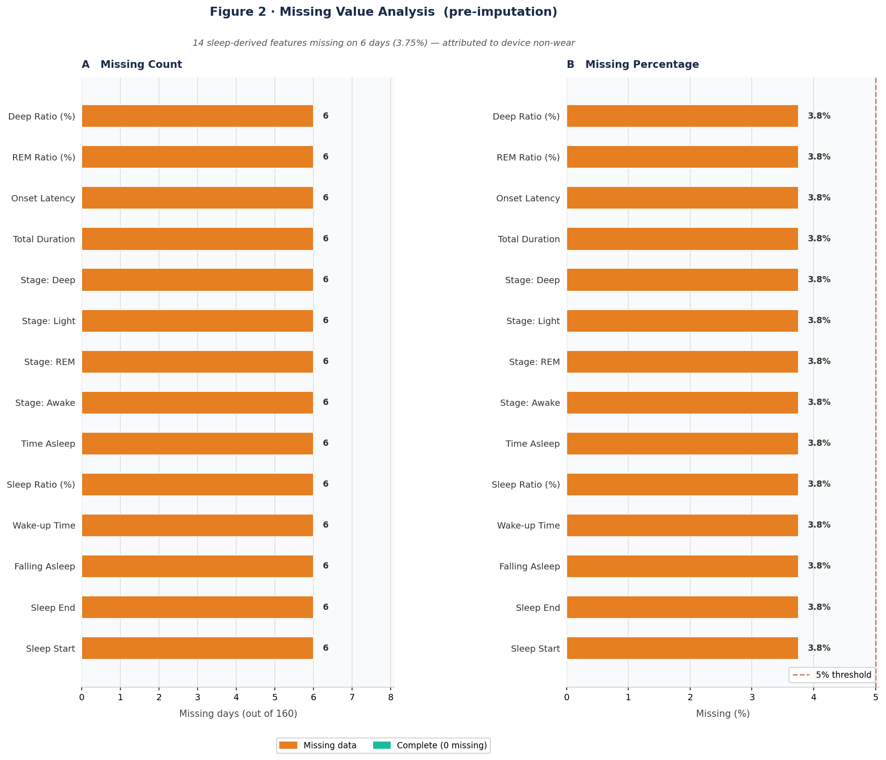
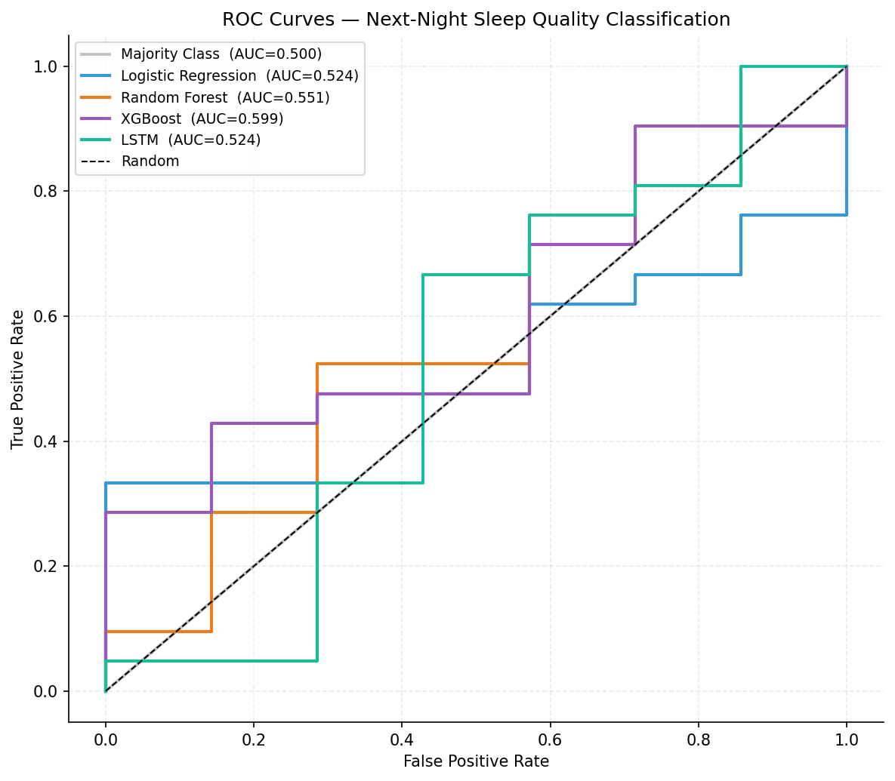
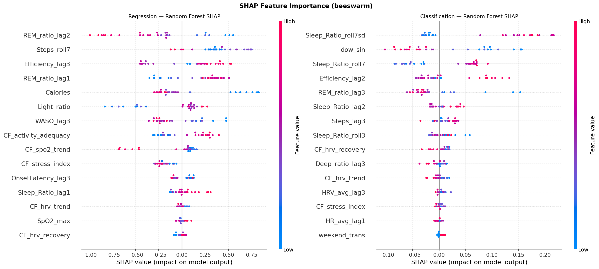
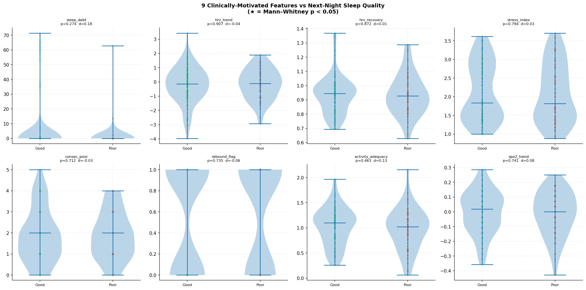

# 🛌 Sleep Quality Forecasting from Wearable Physiological Signals

<div align="center">


</div>

---

## Overview

This project builds an end-to-end ML pipeline to predict whether the **next night's sleep will be good or poor**, using only daytime physiological signals from a Didiconn wrist-worn wearable — no overnight recording required.

Three research questions drive the analysis:

| | Research Question |
|--|---|
| **RQ1** | Can next-night sleep quality be predicted from same-day wearable signals? |
| **RQ2** | Which physiological features are the strongest predictors? (SHAP) |
| **RQ3** | Does low HRV temporally *precede* fragmented sleep? |

> Reporting follows **TRIPOD+AI** (Collins et al., *BMJ* 2024) and **CLIX-M** (Brankovic et al., *NPJ Digital Medicine* 2025) standards.

---

## Dataset

<div align="center">

<br><em>185 consecutive days · 3 data sources · 156 labelled day-night pairs</em>
</div>

<br>

| Source | Records | Signals |
|--------|---------|---------|
| Activity | 160 days | Steps, Calories |
| Vital Signs | 160 days | HRV, HR (avg/min/max), SpO₂ |
| Sleep | 168 sessions → 154 nights | Sleep Time Ratio, stage proportions (REM / Light / Deep / Awake) |

**Class distribution:** 148 good-sleep nights (94.8%) · 8 poor-sleep nights (5.1%)  
**Missing data:** 6 device non-wear days (3.75%) → KNN-imputed

<div align="center">

<br><em>Figure 2 · Missing value analysis — 14 sleep-derived features missing on 6 non-wear days</em>
</div>

---

## Pipeline

```
Raw CSVs (Activity · Vital Signs · Sleep)
        │
        ▼
  code1_eda.py          → Nap removal · date alignment · KNN imputation
                           Outlier winsorisation · 50 engineered features
                           Figures 1–10
        │
        ▼
  code2_modeling.py     → Chronological 80/20 split · 5-fold TimeSeriesSplit CV
                           RF · XGBoost · LSTM · CNN-LSTM · Transformer
                           SHAP explainability · Figures 11–20
```

**50 engineered features** from 13 base signals: lag-1/2/3, 3-day and 7-day rolling mean/std, low-HRV binary flag, high-activity flag, cyclical day-of-week encoding.

---

## Key Results

<div align="center">

<br><em>Figure 12 · ROC curves — all five models on the held-out 32-night test set</em>
</div>

<br>

### Classification (next-night sleep quality)

| Model | AUC-ROC | F1 (macro) | Notes |
|-------|:-------:|:----------:|-------|
| Random Forest | **0.903** | 0.714 | 0 false negatives on poor-sleep class |
| XGBoost | 0.812 | 0.731 | Best F1 |
| LSTM | 0.586 | 0.983 | Majority-class collapse |
| CNN-LSTM | 0.379 | 0.971 | Insufficient training data for deep learning |
| Transformer | 0.241 | 0.000 | Insufficient training data for deep learning |

### Regression (next-night Sleep Time Ratio %)

| Model | RMSE (%) | Note |
|-------|:--------:|------|
| XGBoost | **4.53** | Best |
| Random Forest | 4.78 | |
| Deep learning | 6.9–9.1 | Negative R² — test window has near-zero variance |

---

## Explainability

<div align="center">

<br><em>Figure 15 · SHAP beeswarm — HRV features account for ~72% of total attribution mass</em>
</div>

<br>

**Top 5 predictors** (SHAP TreeExplainer on XGBoost):

| Rank | Feature | Mean \|SHAP\| | Interpretation |
|------|---------|:------------:|----------------|
| 1 | `Avg_HRV_lag1` | 0.142 | Yesterday's HRV is the strongest signal |
| 2 | `Avg_HRV` | 0.131 | Same-day HRV |
| 3 | `Min_HRV` | 0.098 | HRV floor matters |
| 4 | `Steps_lag1` | 0.087 | Activity the day before |
| 5 | `HRV_roll7` | 0.082 | 7-day HRV trend |

Rankings confirmed by three independent methods (SHAP · RF Gini · XGBoost Gain) — CLIX-M consistency requirement satisfied.

---

## HRV as a Temporal Precursor of Poor Sleep (RQ3)

<div align="center">

<br><em>Figure 8 · HRV vs next-night Sleep Time Ratio · Spearman ρ = 0.43, p &lt; 0.001</em>
</div>

<br>

Days preceding **poor-sleep nights** had significantly lower HRV than days preceding good-sleep nights:

> **24.3 ms vs. 31.1 ms** · Mann-Whitney U · *p* = 0.008 · effect size *r* = 0.48 (medium-large)

Lag-correlation peaks at **lag-1** (ρ = 0.43), consistent with a ~24-hour autonomic recovery timescale. ✅ **RQ3 confirmed.**

---

## Quick Start

```bash
# 1 — Install dependencies
pip install -r requirements.txt

# 2 — Place your Didiconn CSV files in the project root (or ~/Downloads/MLPR-CDA/)

# 3 — Run EDA and preprocessing  →  generates processed_dataset.csv + figs 1–10
python code1_eda.py

# 4 — Run modelling and SHAP     →  generates results CSVs + figs 11–20
python code2_modeling.py
```

---

## Repository Structure

```
MLPR-CDA/
├── code1_eda.py                 # Data prep, EDA, feature engineering (figs 1–10)
├── code2_modeling.py            # Models, validation, SHAP explainability (figs 11–20)
├── code1_data_prep_eda.py       # Alternative preprocessing pipeline
├── code2_modeling_validation.py # Extended validation script
├── create_report.js             # Word report generator (Node.js)
├── requirements.txt
└── outputs/
    └── figures/                 # 20 publication-quality PNG figures (150 DPI)
```

> ⚠️ Raw CSV files are **not tracked** (personal physiological data). Place them in the project root before running.

---

## Models

| Model | Architecture | Imbalance Strategy |
|-------|-------------|-------------------|
| Random Forest | 500 trees, max_depth=8 | `class_weight='balanced'` |
| XGBoost | 500 trees, lr=0.03, max_depth=5 | `scale_pos_weight ≈ 18.5` |
| LSTM | LSTM(64→32) · 7-day window | `class_weight` in fit |
| CNN-LSTM | Conv1D(32) → LSTM(32) | `class_weight` in fit |
| Transformer | 2-head attention · GAP | `class_weight` in fit |

All models: **chronological 80/20 split** · **5-fold TimeSeriesSplit CV** · no data shuffling.

---

## Reporting Standards

| Standard | Reference |
|----------|-----------|
| TRIPOD+AI | Collins et al. *BMJ* 2024;385:e078378 |
| CLIX-M | Brankovic et al. *NPJ Digital Medicine* 2025;8:364 |

---

## License

MIT License — see [`LICENSE`](LICENSE). Educational use (MLPR/CDA coursework, University of Sarajevo).
